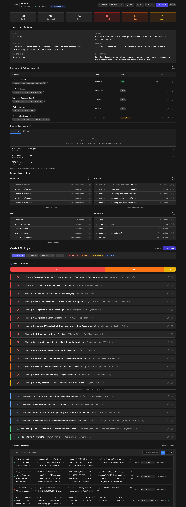

<p align="center">
  
</p>

<h1 align="center">Automated Security Operator</h1>
<h3 align="center">Automated Security Operator</h3>

<p align="center">
  An agent that runs full security assessments end-to-end.<br>
  You define the scope. You review the findings.
</p>

<p align="center">
  <a href="#quick-start">Quick Start</a> •
  <a href="#what-it-does">What It Does</a> •
  <a href="Docs/INSTALLATION.md">Installation</a> •
  <a href="Docs/USER_GUIDE.md">User Guide</a> •
  <a href="Docs/MCP_TOOLS.md">Agent Tools</a> •
  <a href="https://discord.gg/RVJTWtkVA2">Discord</a>
</p>

<p align="center">
  
  
  
  
  <a href="https://github.com/Vasco0x4/ASO/stargazers"></a>
  <a href="https://discord.gg/RVJTWtkVA2"></a>
</p>

---

ASO turns any LLM into an autonomous pentester capable of assessing web
applications, APIs, and infrastructure. The agent reasons, understands
application logic, executes commands in an isolated container,
and documents every finding with the commands used.

---

<p align="center">
  
</p>

---

## Real Results

Claude + ASO isn't just talk. It produces results that end up in CVE databases.

| ID | Severity | Project | Description |
|----|----------|---------|-------------|
| [CVE-2026-32034](https://nvd.nist.gov/vuln/detail/CVE-2026-32034) |  | [openclaw/openclaw](https://github.com/openclaw/openclaw) | Insecure HTTP permits hijacking |
| [GHSA-xfvv-ggvq-pchh](https://github.com/appsmithorg/appsmith/security/advisories/GHSA-xfvv-ggvq-pchh) |  | [appsmithorg/appsmith](https://github.com/appsmithorg/appsmith) | RCE via newline injection in env variable endpoint |
| [GHSA-vvxf-f8q9-86gh](https://github.com/appsmithorg/appsmith/security/advisories/GHSA-vvxf-f8q9-86gh) |  | [appsmithorg/appsmith](https://github.com/appsmithorg/appsmith) | SSRF via SMTP test endpoint — internal port scanning |

*More under responsible disclosure — awaiting publication.*

---

## What It Does

ASO was built to give your AI everything a pentester needs to work.

**A fully equipped execution environment.**
A Docker container loaded with Linux pentesting tools — nmap, sqlmap, ffuf,
nuclei, and anything else it needs. If a tool is missing, the agent installs it.

**Custom exploitation via Python.**
The agent generates and executes Python scripts on the fly — custom payloads,
encoding tricks, protocol quirks, or any logic that off-the-shelf tools can't handle.

**Burp-level HTTP control.**
The agent sends and manipulates HTTP requests directly — headers, cookies, body,
auth tokens. Stored credentials are auto-injected via placeholders. Same power
as Burp Repeater, without the UI overhead.

**A persistent notebook.**
The agent logs what it knows about the application, maps attack paths, records
observations, flags interesting behaviors, and documents every confirmed
vulnerability — commands used, raw output, full context. Stop an engagement
and resume it days later for retest, deeper analysis, or handoff.

### Where is the real pentester?

You review. The AI hands you findings with full context notes, commands,
reproduction steps, and the reasoning that led there. You reproduce, triage,
prioritize, and report.

Your expertise stays where it matters. The grunt work runs on its own.


---

## Quick Start

**Prerequisites:** Docker Desktop + any AI client (Claude, Gemini, GPT...)

```bash
git clone https://github.com/Vasco0x4/ASO.git
cd ASO
./start.sh
```

Dashboard: `http://localhost:31337`

> `./start.sh --dev` — hot reload for contributors
> `./start.sh --lan` — share across your local network (HTTPS, self-signed)
> `./start.sh --domain x.com` — public deploy with Let's Encrypt

### Launch the Agent

```bash
# Auto-detects Claude or Kimi CLI
python3 aso.py --assessment "target-corp"

# Force a specific model
python3 aso.py --assessment "target-corp" --cli claude

# No confirmation prompts
python3 aso.py --assessment "target-corp" --yes
```

### Define Your Scope

```
Load assessment 'target-corp' and start the pentest on https://example.com
Scope: all subdomains, authentication flows, API endpoints
Exclude: brute-force on /login
```

> Full setup for all AI clients → [INSTALLATION.md](Docs/INSTALLATION.md)

---

## Supported Models

ASO is model-agnostic. Any LLM with tool-calling support works.

| Client | Setup |
|--------|-------|
| **Claude Code** | `python3 aso.py` (automatic) |
| **Kimi CLI** | `python3 aso.py` (automatic) |
| **External API** (OpenAI-compatible) | `python3 aso.py --base-url` |
| **Claude Desktop** | MCP config |
| **ChatGPT Desktop** | MCP config |
| **Gemini CLI** | MCP config |

The smarter the model, the deeper the engagement. Swap models without changing anything else.

---

## Agent Tools

| Tool | |
|------|-|
| `execute()` | Run any command in the pentesting container |
| `scan()` | nmap, gobuster, ffuf, nikto, dirb |
| `subdomain_enum()` | Subdomain discovery |
| `ssl_analysis()` | TLS/SSL audit |
| `tech_detection()` | Technology fingerprinting |
| `python_exec()` | Execute Python in the container |
| `http_request()` | HTTP client with credential auto-substitution |
| `add_card()` | Log a finding — CVSS 4.0 auto-scored |
| `credentials_add()` | Store credentials, auto-injected via `{{PLACEHOLDER}}` |

Built-in `aso-pentest` container (~2 GB, starts automatically). Plug in [Exegol](https://github.com/ThePorgs/Exegol) for 400+ tools — switchable anytime from the dashboard.

> Full reference → [MCP_TOOLS.md](Docs/MCP_TOOLS.md)

---

## What's New in v1.1.0

- **Authentication** — JWT, admin/user roles, first-run setup wizard
- **PDF reports** — one-click export per assessment
- **CVSS 4.0** — automatic scoring on every finding
- **Attack timeline** — auto-generated per engagement
- **Notifications** — Telegram, Slack, Email with optional PDF attachment
- **Assessment templates** — start from predefined methodologies
- **`aso-pentest` container** — lightweight built-in environment, no Exegol required
- **`python_exec` + `http_request`** — advanced execution tools
- **Cross-assessment findings view** — aggregate and filter findings across all engagements
- **Security hardening** — Docker socket proxy, path traversal prevention, localhost-only DB

> !! Run locally or on your LAN. Do not expose the dashboard to the public. !!

---

## Documentation

| | |
|--|--|
| [INSTALLATION.md](Docs/INSTALLATION.md) | Full setup — all AI clients |
| [USER_GUIDE.md](Docs/USER_GUIDE.md) | Platform usage guide |
| [MCP_TOOLS.md](Docs/MCP_TOOLS.md) | Agent tool reference |
| [ARCHITECTURE.md](Docs/ARCHITECTURE.md) | Technical deep dive |

---

## Contributing

ASO is actively developed.

**Planned:**
- OWASP testing guidelines integration
- Multi-agent mode — specialized sub-agents per phase
- Active Directory / internal network module
- Enhanced CLI capabilities

Issues and PRs welcome → [GitHub Issues](https://github.com/Vasco0x4/ASO/issues)

---

## License

**AGPL v3** — free and open source.

---

## Credits

- [Anthropic MCP](https://modelcontextprotocol.io/) — the tool-calling protocol powering agent actions
- [Exegol](https://github.com/ThePorgs/Exegol) — supported as alternative container
- The security community for the open-source tooling

---

<p align="center">
  Questions or feedback? Join the community on <a href="https://discord.gg/RVJTWtkVA2"><strong>Discord</strong></a>
</p>

<p align="center">
  <a href="https://github.com/Vasco0x4/ASO">⭐ Star on GitHub</a> •
  <a href="https://discord.gg/RVJTWtkVA2">💬 Discord</a> •
  <a href="https://github.com/Vasco0x4/ASO/issues">Report Bug</a> •
  <a href="mailto:Vasco0x4@proton.me">Contact</a>
</p>
